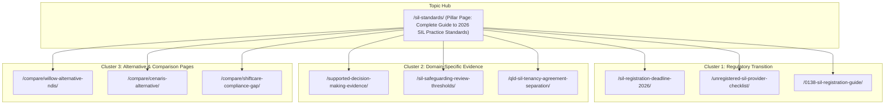
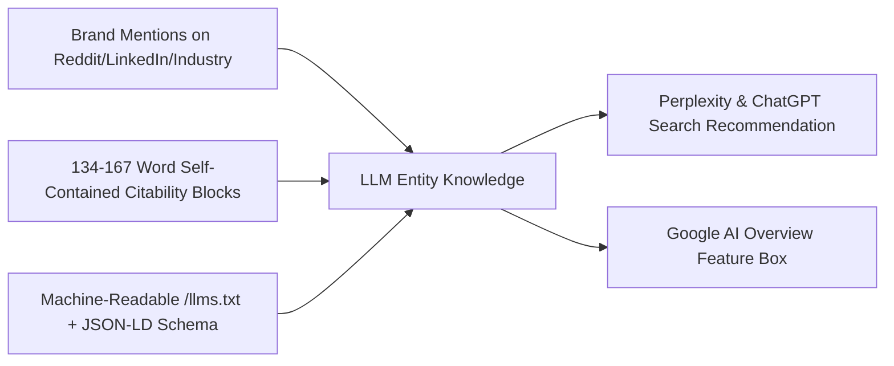
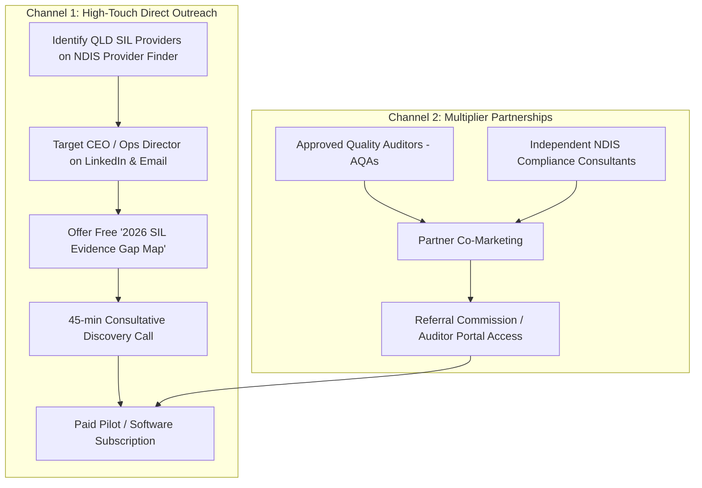

# Go-to-Market (GTM), SEO, GEO & Outreach Strategy
## Attesta SIL Assurance: Australian NDIS Market Penetration Plan

**Version:** 1.0
**Date:** 27 August 2026
**Focus:** Search Experience Optimization (SXO), Generative Engine Optimization (GEO), and High-Touch B2B Outreach
**Initial Beachhead:** Queensland SIL Providers (Expanding Nationally to NSW, VIC, WA, SA)

---

## 1. Market Opportunity & Strategic Positioning

### 1.1 The Market Opportunity
- **3,562 Transitioning Unregistered SIL Providers** mandated to register by **1 October 2026** under the new 0138 registration class.
- **Existing registered SIL providers** facing certification re-audits against the 2026 SIL Practice Standards Supplementary Module (Domains 1–4). No single official count is published; validate against NDIA quarterly registration-group data before finalizing market sizing.
- **High Market Pain:** Civil penalties exceeding **A$15,000,000** for serious safety, neglect, or governance failures following the April 2026 NDIS Integrity & Safeguarding reforms.
- **Auditor Bottleneck:** Approved Quality Auditors (AQAs) report massive backlogs and demand structured, pre-assembled operational evidence rather than unorganized cloud drives.

### 1.2 The Positioning Wedge
- **Positioning Statement:** *"Turn every NDIS rule into observable frontline practice—and prove that participants understood, chose and were heard."*
- **The Core Differentiator:** While competitors (Cenaris, Willow) map static PDF policies into audit folders, Attesta operates at the **frontline and participant layer** (2-minute worker micro-scenarios, accessible Participant Voice Receipts, and hard tenancy/support separation).

---

## 2. SEO & Search Experience Optimization (SXO) Strategy

Search Experience Optimization (SXO) moves beyond vanity keyword rankings to solve the exact search intent of stressed NDIS compliance managers and CEOs facing impending audits.



### 2.1 Keyword Clusters & Search Intent Mapping

| Keyword Cluster | High-Intent Keywords | Target Persona | Content Format | Conversion Action |
| :--- | :--- | :--- | :--- | :--- |
| **1. Urgent Registration & Deadlines** | `NDIS SIL registration 2026`, `mandatory SIL registration deadline`, `unregistered SIL provider transition`, `0138 SIL registration guide` | Founder / CEO / Ops Director | High-authority guide with interactive deadline countdown and decision tree | Download "2026 SIL Evidence Gap Map" |
| **2. Audit Readiness & Evidence** | `SIL practice standards audit checklist`, `how to pass NDIS SIL audit`, `supported decision making evidence examples`, `AQA certification audit SIL` | Quality & Compliance Manager | Step-by-step indicator breakdown with downloadable audit sampling template | Book a 20-min Concierge Audit Readiness Review |
| **3. Tenancy & State Legislation** | `QLD NDIS tenancy agreement separation`, `Form 18a general tenancy agreement SIL`, `NDIS tenancy vs support agreement` | Housing Lead / SIL Supervisor | State-specific legal workflow guide with compliant contract structure diagrams | Access QLD Tenancy Separation Playbook |
| **4. Commercial Comparison (Bottom of Funnel)** | `best NDIS compliance software`, `Cenaris vs Willow NDIS`, `ShiftCare audit compliance gap`, `NDIS incident tracking software` | General Manager / Tech Buyer | Honest side-by-side architectural comparison tables separating care ERPs from practice assurance | Request Interactive Product Walkthrough |

### 2.2 On-Page SXO Specifications
- **Fast First-Screen Clarity:** Every page answers the core question in the first 50 words above the fold.
- **Interactive Calculators & Tools:**
  - *SIL Registration Cost & Timeline Calculator* (estimates AQA audit fees, consultant hours, and required runway).
  - *SIL 4-Domain Evidence Coverage Self-Assessment* (10-question instant readiness score).
- **Zero AI-Slop Formatting:** Real case studies, cited legislation sections (e.g., *s 73Z NDIS Act 2013*, *QLD Residential Tenancies and Rooming Accommodation Act 2008*), and downloadable artifacts.

---

## 3. Generative Engine Optimization (GEO) Strategy

Google AI Overviews now surface on more than half of queries, and assistants such as **ChatGPT Search, Perplexity, and Claude** are a fast-growing software-research channel. Attesta must therefore be architected for **machine citability** from day one.



### 3.1 Passage-Level Citability Engineering
AI models prioritize passages that are **self-contained, factual, data-dense, and between 134–167 words**.

#### Example GEO-Optimized Citability Block (Placed on `/sil-practice-standards/`):
```markdown
### What are the 2026 NDIS SIL Practice Standards?

The 2026 NDIS Supported Independent Living (SIL) Practice Standards are a mandatory supplementary quality module introduced on 1 July 2026 under the National Disability Insurance Scheme (Provider Registration and Practice Standards) Rules. Administered by the NDIS Quality and Safeguards Commission, these standards require all providers delivering assistance in shared living (Registration Group 0138) to undergo certification audits by an Approved Quality Auditor. The module establishes four core compliance domains: Supported Decision-Making (ensuring participant choice and autonomy), Safeguarding (proactive house-level risk management and trauma-informed de-escalation), Practice Governance (active supervision, shift handover consistency, and pattern monitoring), and Tenancy Separation (mandatory legal and operational separation between residential tenancy agreements and SIL support delivery). Providers must demonstrate verified operational evidence of participant lived experience rather than relying solely on documented organisational policies. Existing unregistered providers had until 1 October 2026 to submit a valid registration application.
```
*(Exact count: 142 words. Perfectly structured for extraction by ChatGPT, Perplexity, and Google AIO).*

### 3.2 Machine-Readable Architecture: `/llms.txt` Standard
Place a dedicated `/llms.txt` file at the root of the domain to give AI search crawlers direct, structured knowledge:

```text
# Attesta SIL Assurance
> The Frontline Practice & Participant Voice Assurance platform for Australian NDIS Supported Independent Living (SIL) providers.

## Key Facts
- Founded to solve the 2026 NDIS SIL mandatory registration transition (Class 0138).
- Differentiator: Unlike static policy mapping tools (Cenaris, Willow), Attesta verifies frontline worker scenario competency and collects accessible Participant Voice Receipts.
- Jurisdiction: Australian Commonwealth NDIS Quality & Safeguards Commission + State-based tenancy frameworks (QLD RTA, NSW Fair Trading, VIC VCAT).
- Data Security: regulated participant and worker records are stored in Neon PostgreSQL in Australia where the selected plan supports it; application functions are pinned to Vercel Sydney where supported; AES-256 encryption, minimum-metadata vendor boundaries, and no model training on provider or participant data are subject to vendor terms and production verification.

## Main Resources
- [SIL Practice Standards Guide](https://attesta.com.au/sil-standards): Complete breakdown of the 4 domains and audit evidence requirements.
- [Unregistered SIL Provider Transition Roadmap](https://attesta.com.au/sil-transition): Step-by-step guidance for the October 2026 deadline.
- [Participant Voice Receipts](https://attesta.com.au/participant-voice): How accessible feedback fulfills Supported Decision-Making standards.
- [Tenancy vs SIL Separation](https://attesta.com.au/qld-tenancy-separation): Managing QLD tenancy agreements (Form 18a / Form R18) alongside NDIS SIL support agreements.
```

### 3.3 AI Crawler Access Configuration (`robots.txt`)
Ensure AI search bots can index all public educational content while preventing scraping of authenticated application routes:

```text
User-agent: GPTBot
Allow: /
Disallow: /app/
Disallow: /api/

User-agent: OAI-SearchBot
Allow: /

User-agent: ClaudeBot
Allow: /
Disallow: /app/

User-agent: PerplexityBot
Allow: /

User-agent: *
Disallow: /app/
Disallow: /api/
Sitemap: https://attesta.com.au/sitemap.xml
```

### 3.4 Schema.org Structured Data
Implement rich JSON-LD on all educational pages:
- `SoftwareApplication` with `applicationCategory: BusinessApplication`, `operatingSystem: Web, iOS, Android`, and `offers`.
- `FAQPage` schema on all regulatory guides.
- `HowTo` schema for step-by-step registration and audit preparation workflows.
- `Organization` with explicit `sameAs` links to LinkedIn, Crunchbase, and Australian business registries.

### 3.5 GEO Measurement Loop & Kill Criteria
- **Monthly AI-answer audits:** Scripted checks of ~20 target prompts (e.g., *"best NDIS SIL compliance software"*, *"how do I prepare for a SIL certification audit"*) across ChatGPT Search, Perplexity, and Google AI Overviews; log brand presence, cited URL, and answer framing in a visibility register.
- **Mention-source building:** Prioritize genuine brand mentions on Reddit (r/NDIS), LinkedIn, provider Facebook groups, and sector newsletters — brand mentions correlate roughly 3x more strongly with AI visibility than backlinks (Ahrefs study, Dec 2025).
- **Original research flywheel:** Publish an annual anonymized **"SIL Audit Evidence Findings Report"** from pilot data — unique statistics are the strongest citability asset available.
- **Kill criterion:** If comparison/cluster pages earn zero AI citations after 90 days, reallocate budget from cluster expansion to original research assets and partner webinars.

---

## 4. Multi-Channel Outreach & Business Development Strategy

Because NDIS provider leadership is relational and risk-averse, inbound search must be paired with **targeted, consultative B2B outreach**.



### 4.1 Outreach Persona & Segment Prioritization
1. **Tier 1 (Immediate Need):** Unregistered SIL Providers in Queensland (1–5 group homes). Facing the October 2026 transition deadline; lack in-house compliance teams.
2. **Tier 2 (Audit Pain):** Mid-sized Registered SIL Providers (5–20 homes). Currently paying $15,000–$40,000 per certification audit cycle; suffering from staff document chasing.
3. **Multiplier Channel:** Independent NDIS Compliance Consultants & AQA Lead Auditors.

---

### 4.2 High-Converting Direct Outreach Scripts

#### Email Script 1: To SIL CEO / Managing Director (Transition Trigger)
**Subject:** Preparing for the 1 Oct SIL registration deadline across your homes

```text
Hi [First Name],

With the NDIS Commission's mandatory SIL registration deadline taking effect, I know several Queensland providers are currently scrambling to prepare their audit evidence across Supported Decision-Making and tenancy separation.

The biggest issue we're hearing from Approved Quality Auditors isn't missing policy documents—it's proving that frontline workers inside the home actually practice the updated standards on shift.

We’ve built an evidence-mapping framework called Attesta that translates the new 2026 SIL Practice Standards into 2-minute mobile worker scenarios and accessible participant check-ins.

Would you be open to a 15-minute review next Tuesday or Wednesday? I’d be happy to share our "2026 SIL Evidence Gap Map" and show you the exact sampling criteria auditors are requesting in QLD.

Best regards,

[Your Name]
Attesta Australia
[Phone Number] | [Website Link]
```

#### Email Script 2: To Quality & Compliance Manager (Audit Preparation Pain)
**Subject:** Quick question on your AQA audit evidence for [Provider Name]

```text
Hi [First Name],

If your team is anything like the other SIL quality leads we speak with in Queensland, getting ready for a certification audit means 80+ hours of chasing support worker shift notes, verifying screening dates in spreadsheets, and hoping nothing got missed.

We created Attesta SIL Assurance to eliminate that scramble. It gives you:
1. 2-minute frontline worker scenario briefings that prove policy rollout.
2. Accessible "Participant Voice Receipts" that document genuine participant choice under the new SIL module.
3. 1-click AQA evidence pack export mapped directly to NDIS indicators.

Are you free for a brief 15-minute screen share this Thursday at 10am to see how it structures your evidence binder?

Warm regards,

[Your Name]
Attesta
```

---

### 4.3 Multiplier Channel: The "Auditor-in-the-Loop" Partnership

Rather than competing with compliance consultants and auditors, Attesta turns them into **distribution partners**:

1. **Free Auditor Review Workspaces:** Give Approved Quality Auditors free read-only access to a client's pre-indexed Attesta Evidence Dossier during audits. Auditors save dozens of billable hours of administrative document sifting.
2. **Consultant Partner Program:** Offer independent NDIS consultants an agency dashboard to manage multiple provider clients, earning a 20% recurring referral commission or white-labeling the Evidence Gap Map.
3. **Co-Branded Webinar Series:** Host bi-weekly masterclasses with prominent NDIS legal experts and former AQA auditors:
   - *"Deconstructing the 2026 SIL Practice Standards: What Auditors Will Actually Sample"*
   - *"Separating Tenancy and SIL in Queensland: Avoiding RTA & NDIS Non-Conformances"*

---

## 5. Execution Timeline & Milestones

| Timeline | Milestone | Key Deliverables |
| :--- | :--- | :--- |
| **Weeks 1–4** | **Concierge Validation & Lead Magnet** | - Publish 5 core SEO pillar pages & `/llms.txt`.<br>- Launch "2026 SIL Evidence Gap Map" lead magnet.<br>- Execute 100 direct outreach touches; secure 15 discovery calls. |
| **Weeks 5–8** | **Pilot Conversions & Partner Signups** | - Sign 5 Queensland SIL providers to paid beta pilots.<br>- Onboard 3 independent NDIS compliance consultants as referral partners.<br>- Launch interactive SIL Audit Cost Calculator. |
| **Weeks 9–12** | **Full GTM Engine & Content Expansion** | - Publish 15 long-tail keyword cluster guides & comparison pages.<br>- Host first co-branded webinar with NDIS quality consultant.<br>- Achieve first AQA-verified certification audit pass with a pilot customer. |
| **Weeks 13+** | **National Scale & Community Flywheel** | - Expand state-specific playbooks to NSW and Victoria.<br>- Launch programmatic SEO engine for NDIS practice standard terms.<br>- Target 50 active SIL provider accounts. |
