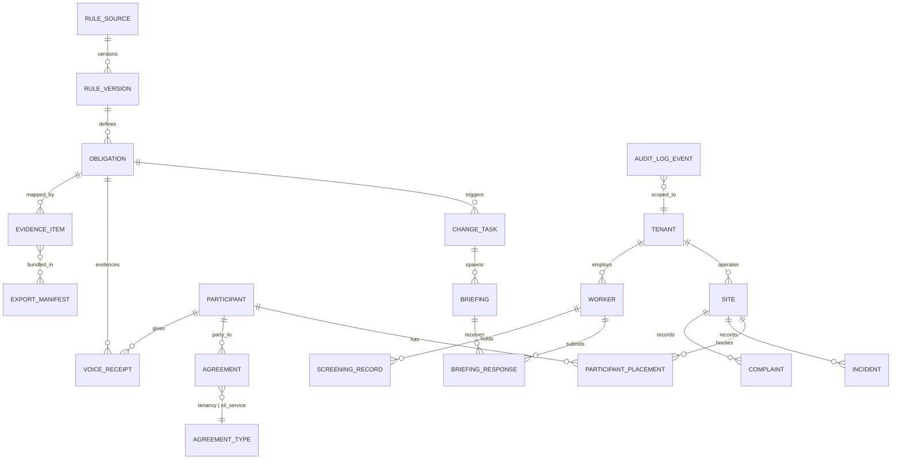

# Product Requirements Document (PRD) — v2.0

## PRODUCT UNDER DEVELOPMENT
**Attesta** (working title, formerly "RuleTrace SIL Assurance") — an administrative compliance-enablement platform that turns NDIS Practice Standards obligations into verified frontline actions, accessible participant confirmations, and audit-ready evidence for registered Supported Independent Living (SIL) providers.

**Version:** 2.0 (supersedes `PRD-NDIS-SIL-ASSURANCE.md` v1.1)
**Date:** 27 August 2026
**Owner:** Product (Senior Principal PM) — Legal review pending (see OQ ledger)
**Jurisdiction:** Australia — Commonwealth NDIS framework + Queensland state overlays first

**CRITICAL DIRECTIVE (binding on all releases):** Misrepresenting NDIS obligations exposes providers to civil penalties under the NDIS Act 2013 (Cth) `[VERIFY → exact Part/Division renumbering post-National Disability Insurance Scheme Amendment (Integrity and Safeguarding) Act 2026 before citing in any user-facing copy]`. Fabricated regulatory citations, compliance-outcome guarantees, and treating AI output as a substitute for human or clinical judgement are strict release blockers (Rules R1–R4).

---

## 0. Naming Decision Note

RuleTrace is retired: it signals generic "regulation tracking," the exact category (Cenaris, Willow) we are differentiating away from, and it undersells the participant-voice wedge.

| Candidate | Rationale | Risks / Checks |
| :--- | :--- | :--- |
| **Attesta** (recommended) | From *attestari* — "to bear witness." Captures all three product surfaces: workers attest to practice, participants attest to lived experience, providers attest to auditors. Short, spellable, brandable, works as a verb-adjacent noun ("Attesta receipt"). | `[VERIFY → attesta.com.au availability; ASIC name search; IP Australia TM classes 9/42; conflict check vs. US "Attest" brands]` |
| LivedProof | Literal statement of the wedge ("standards lived in the home"). Strong for SEO/GEO descriptiveness. | Harder to trademark (descriptive); longer; weaker as company brand than product-line name. |
| Praxa | From *praxis* — practice over paper. Short, abstract, scalable beyond NDIS. | Abstract names need higher marketing spend to attach meaning; possible existing Pty Ltd conflicts `[VERIFY]`. |

**Decision:** Proceed as **Attesta**, with "LivedProof" reserved as a potential flagship feature name for the Participant Voice Receipt module (e.g., "LivedProof Receipts by Attesta"). Domain/TM verification is OQ-003 and blocks public launch, not development.

---

## 1. Executive Summary

Attesta is a compliance-enablement SaaS for **registered NDIS providers delivering Supported Independent Living** (registration group 0138 — Assistance with Supported Independent Living). From 1 July 2026, SIL providers must be registered with the NDIS Quality and Safeguards Commission and comply with new SIL Practice Standards; previously unregistered providers had to submit a registration application by 1 October 2026 to keep delivering SIL [Source: NDIS Commission, "Mandatory registration and transition pathways for supported independent living," ndiscommission.gov.au reform hub].

Attesta converts each obligation into: (1) human-approved change tasks, (2) two-minute worker micro-briefings with scenario verification, (3) accessible **Participant Voice Receipts** (Easy Read, plain language, audio) evidencing supported decision-making, and (4) a one-click, indicator-indexed evidence pack for certification audits by Approved Quality Auditors.

**Funding-type scope (explicit):** Attesta supports evidence and practice workflows regardless of how a participant's plan is managed — NDIA/Agency-managed, Plan-managed, or Self-managed. Attesta is **not** a claiming, invoicing, or price-limit engine; payment-eligibility nuances post-1 July 2026 (e.g., plan managers only paying registered or registration-pending 0138 providers) are surfaced as informational guidance only [Source: NDIA, "Guide to providing supported independent living (SIL)," ndis.gov.au] `[VERIFY → self-managed participant payment treatment for SIL post-transition]`.

Attesta is administrative enablement software. It does not determine compliance outcomes, does not issue worker screening clearances, and does not replace clinical or NDIA "reasonable and necessary" decisions (R4).

*(≈240 words)*

---

## 2. Problem & Evidence Base

1. **A large, deadline-driven cohort.** The Commonwealth regulatory impact analysis estimated **3,562 unregistered SIL providers** affected by mandatory registration [Source: Office of Impact Analysis, Supplementary Analysis, oia.pmc.gov.au, July 2026]. The wider market: **280,258 unique active providers** in Q4 2025–26, of which 18,309 were active registered providers [Source: NDIA Quarterly Report Q4 2025–26, appendices]. A published count of *SIL-registered* providers specifically is not available `[VERIFY → NDIA quarterly registration-group data before TAM finalization]` (assumption: serviceable market of 3,000–5,000 SIL organisations).
2. **Enforcement escalation.** The National Disability Insurance Scheme Amendment (Integrity and Safeguarding) Act 2026 (passed 1 April 2026) strengthened Commission enforcement powers; the Commission states maximum civil penalties can exceed **A$15 million** where a participant is hurt or injured in a provider's care [Source: NDIS Commission media release, "Regulator welcomes new powers…", ndiscommission.gov.au].
3. **Evidence, not policies, is what audits sample.** Commission audit guidance states auditors may inspect incident reports, complaints records, training logs, supervision notes, participant records and worker files [Source: NDIS Commission, "Types of audits," ndiscommission.gov.au]. Providers using folders/spreadsheets reconstruct this evidence manually.
4. **Participant voice is now a standards requirement.** The SIL Practice Standards and their Quality Indicators (National Disability Insurance Scheme (Quality Indicators for NDIS Practice Standards) Amendment (Supported Independent Living) Guidelines 2026) repeatedly require evidence of what participants understood and chose — e.g., the tenancy standard's participant statement: "I am supported to understand my service and tenancy agreement are separate documents…" [Source: NDIS Commission, SIL supplementary module — Agreements about tenancy, housing and support].
5. **Royal Commission context.** The Royal Commission into Violence, Abuse, Neglect and Exploitation of People with Disability (Final Report, 2023) documented systemic failures in supported accommodation oversight and recommended strengthened provider regulation `[VERIFY → exact volume/recommendation numbers before citing in marketing]`.
6. **Competitor gap (verified from public materials, Aug 2026):** care-management suites (ShiftCare, Brevity, Lumary) record operational events but do not verify practice comprehension; evidence-mappers (Cenaris, Willow) organise documents but do not capture frontline or participant attestation. No surveyed competitor publicly offers accessible participant confirmation linked to SIL quality indicators (assumption: based on public feature pages reviewed 27 Aug 2026; continuous competitive monitoring required).

---

## 3. Personas & Context

| Persona | Context | Core Job-to-be-Done | Funding-type nuance |
| :--- | :--- | :--- | :--- |
| **Provider Ops/Quality Lead** ("Sarah", 8 homes) | Owns registration, audit prep, policy currency | Pass certification audit without the 80-hour scramble; keep every home consistent | Must evidence compliance regardless of participants' plan-management mix |
| **House Supervisor / Key Worker** ("Marcus", 2 homes) | Runs rosters, handovers, house meetings | Prove his team practises updated procedures; catch friction early | N/A (practice layer) |
| **Support Worker** ("Chloe", casual) | Mobile-first, time-poor, app-fatigued | Understand what changed and what to do, in under 2 minutes, on her phone | N/A |
| **Participant** ("Liam", 3-person SIL home) | Prefers Easy Read + audio; wants real say in home life | Confirm/correct/challenge records about his choices safely | Plan management type does not alter his rights under the Code of Conduct [Source: NDIS (Code of Conduct) Rules 2018] |
| **Nominee / Family Advocate** ("Anh") | Supports her brother's decisions | Co-sign consent where authorised; visibility of concern outcomes | Nominee authority boundaries must be respected (see §7 consent mechanics) |
| **Support Coordinator** ("Priya") | Arranges/monitors SIL arrangements across providers | Verify provider registration status and agreement separation before referral | Advises across Agency/Plan/Self-managed participants |
| **Approved Quality Auditor** (external, "David") | Samples evidence against Core + SIL modules | Trace obligation → practice → participant experience quickly | N/A |

**Scope boundary:** Early Childhood Approach (ECA) and school-age transition workflows are **out of scope** — Attesta v2 targets SIL (predominantly adult participants). ECA-specific obligations (e.g., early childhood practice standards) are explicitly excluded to avoid scope misrepresentation.

**Provider tier note:** Attesta's primary tier is **Registered Providers** (full Practice Standards + audit obligations). Unregistered providers (Code of Conduct obligations only [Source: NDIS (Code of Conduct) Rules 2018]) may use a limited "transition workspace" to prepare a registration application — Attesta must never imply unregistered providers may lawfully deliver SIL after the transition window [Source: NDIS Commission, mandatory registration SIL page: "Providing supported independent living without registration is a serious offence"].

---

## 4. Goals & Success Metrics

All metrics are **operational compliance shifts** — no clinical-outcome claims (R4).

| Goal | Metric | Baseline (assumption) | Target @ 12 months |
| :--- | :--- | :--- | :--- |
| Kill the audit scramble | Time to assemble auditor-requested evidence chain | 5–14 days manual | < 15 minutes, 95th percentile |
| Prove policy-to-practice rollout | Workers completing scenario-verified briefings within 48h of an approved change | ~0% (read-receipts only) | ≥ 90% |
| Evidence participant voice | Active SIL participants with ≥1 Voice Receipt per quarter in preferred format | ~0% structured | ≥ 80% |
| Screening currency | Rostered-worker days with expired/absent clearance recorded in Attesta | unknown | 0 (with alerts ≥ 30 days pre-expiry) |
| Notification-window discipline | Reportable-incident checklists opened within statutory windows (24h / 5 business days) [Source: NDIS (Incident Management and Reportable Incidents) Rules 2018, ss 18–21] | unknown | 100% of logged incidents show window status |
| Commercial viability | Net revenue retention / logo churn | n/a | NRR ≥ 115%; monthly logo churn ≤ 1.5% (assumption) |

---

## 5. Phased Scope

**MVP (≤ 90 days) — "Evidence spine + participant voice":**
1. Versioned rule library: Core Module + SIL supplementary module + SIL Quality Indicators (2026 amendments), with human-approved change tasks.
2. Worker micro-briefings with one-question scenario verification; supervisor exception dashboard.
3. Participant Voice Receipts v1: plain language + Easy Read template + audio playback (TTS) and audio-response capture (STT), advocate co-sign mode, anti-coercion escalation route.
4. Evidence vault with append-only audit log; one-click AQA export indexed by standard/indicator.
5. QLD playbooks: tenancy/SIL separation checklist (Form 18a / Form R18 agreement types) [Source: Residential Tenancies and Rooming Accommodation Act 2008 (Qld); RTA Qld forms]; worker screening currency register; reportable-incident window checklists.
6. Tenant security baseline: MFA, RBAC, AU data residency, 7-year retention defaults (see §8).

**Phase 2 (≤ 6 months):**
- Pattern-review thresholds across incidents/complaints/receipts (decision-support only, R4).
- Auditor read-only workspaces; consultant multi-client dashboards.
- NSW + VIC tenancy/screening overlays (legal review gated).
- Rostering/HR integrations: ShiftCare, Brevity, Employment Hero via webhooks/CSV (hypothesis — no public partnership agreed).
- AI capabilities A1–A7 (see §9.3) beyond the MVP subset (A3/A5 ship in MVP for accessibility).

**Backlog:**
- Aged-care (ACQS) cross-framework mapping; NDIA DPO API integration for provider-portal automation (hypothesis; requires registered-provider partnership + cyber clearance [Source: NDIA, "Connecting with NDIA systems," ndis.gov.au]); white-label consultant edition; multi-language worker briefings.

---

## 6. User Journeys & Functional Epics

### Epic E1 — Versioned Rule Library & Change-to-Practice Tasks
As a Quality Lead, I see exactly what changed in an obligation source and what my organisation must do, with nothing propagating until I approve it.

```gherkin
Feature: Human-approved change tasks
  Scenario: A monitored source publishes an updated SIL guidance page
    Given the rule library holds version N of "SIL supplementary module — Tenancy"
    And Attesta ingests version N+1 with a highlighted text diff
    When the system drafts an impact assessment listing affected homes, roles and documents
    Then the draft is held in "Pending Quality Lead approval" state
    And no worker task, briefing or policy edit is created until a named approver acts
    And the approval (or rejection) is written to the append-only audit log with the source diff attached

  Scenario: Approver rejects an AI-drafted impact assessment
    Given an impact assessment draft flagged "AI-assisted"
    When the Quality Lead rejects it with a reason
    Then no downstream artefacts are generated
    And the rejection reason is retained for audit
```

### Epic E2 — Worker Micro-Briefings & Scenario Verification
```gherkin
Feature: Scenario-verified briefings
  Scenario: Worker completes a 2-minute briefing before shift
    Given an approved change task targeting "House 3 — evening shift workers"
    When Chloe opens the briefing on her phone
    Then she sees a plain-language summary of ≤ 200 words
    And answers one scenario question with immediate feedback
    And her response, timestamp, briefing version and outcome are recorded immutably

  Scenario: Repeated incorrect scenario answers
    Given a worker answers the same scenario incorrectly twice
    Then the supervisor exception dashboard flags the worker for follow-up coaching
    And no disciplinary action is taken or suggested by the system
```

### Epic E3 — Participant Voice Receipts (LivedProof)
```gherkin
Feature: Accessible participant confirmation
  Scenario: Tenancy vs service agreement understanding check
    Given Liam's home has a new co-tenant agreement event
    When a Voice Receipt is offered in Liam's preferred format (Easy Read + audio)
    Then Liam can confirm, correct, or flag "I want to talk to someone"
    And "no response" is recorded as "not obtained" — never as consent
    And a flagged response routes to the Quality Lead and displays independent advocacy contacts

  Scenario: Advocate co-sign within authority boundaries
    Given Anh is recorded as nominee for specified decision domains
    When a receipt outside those domains is generated
    Then Anh is not offered co-sign authority for that receipt
```

### Epic E4 — Screening & Statutory-Window Registers
```gherkin
Feature: Worker screening currency register
  Scenario: Clearance approaching expiry
    Given a worker in a risk assessed role has an NDIS Worker Screening Clearance expiring in 30 days
    Then the register shows amber status with 90/60/30-day alerts already sent
    And the UI states clearances are issued by state/territory Worker Screening Units — Attesta displays status only
    # [Source: NDIS (Practice Standards—Worker Screening) Rules 2018 — risk assessed roles]

Feature: Reportable-incident window checklist
  Scenario: Incident logged
    Given a supervisor logs an incident categorised as potentially reportable
    Then Attesta displays the applicable notification window (24 hours, or 5 business days for
         unauthorised restrictive practice without serious injury)
    And shows a checklist of information the Commission portal requires
    And records who was notified and when — without submitting anything to the Commission itself
    # [Source: NDIS (Incident Management and Reportable Incidents) Rules 2018, ss 18–21]
```

### Epic E5 — Evidence Vault & AQA Export
```gherkin
Feature: One-click audit pack
  Scenario: Auditor requests a stratified sample
    Given an AQA requests "2 participants per home, tenancy domain, last 12 months"
    When Sarah runs the sampling helper
    Then Attesta produces an export grouped by standard and quality indicator
    And every item carries source lineage (who, when, version, hash)
    And the export manifest is written to the append-only log
```

### Epic E6 — QLD Tenancy/SIL Separation Playbook
```gherkin
Feature: Dual-agreement separation check
  Scenario: New participant onboarding in a provider-leased home
    Given the provider owns or controls the dwelling
    Then the playbook requires a tenancy/rooming agreement (Form 18a or Form R18) distinct from the SIL service agreement
    And requires a recorded conflict-of-interest disclosure
    And offers a Voice Receipt confirming the participant had the difference explained
    # [Source: SIL Practice Standards — Agreements about tenancy, housing and support;
    #  Residential Tenancies and Rooming Accommodation Act 2008 (Qld)]
```

### Epic E7 — AI-Assisted Drafting & Mapping (Human-in-Command)
Covered in §9.3; every AI feature ships behind the approval gates defined in E1/E3 and the guardrails in §9.4.

---

## 7. Compliance Mapping Matrix

| Feature | Duty Engaged | Primary Instrument | Target Provider Tier | QA Artefact Produced |
| :--- | :--- | :--- | :--- | :--- |
| Versioned rule library + change tasks | Maintain systems meeting conditions of registration | NDIS Act 2013 (Cth) (registration conditions) `[VERIFY exact ss post-2026 amendments]`; NDIS (Provider Registration and Practice Standards) Rules 2018 as amended by the Mandatory Registration and Other Matters Rules 2026 | Registered (0138) | Source diff + approval log entry |
| Worker micro-briefings | Workforce competence/training quality indicators | NDIS Practice Standards Core Module (HR management) + NDIS (Quality Indicators) Guidelines 2018 (as amended) | Registered | Briefing completion + scenario outcome records |
| Participant Voice Receipts | Person-centred supports; supported decision-making; participant experience evidence | SIL Practice Standards 2026 + Quality Indicators (SIL) Guidelines 2026; NDIS (Code of Conduct) Rules 2018 | Registered (Code of Conduct duties also bind unregistered tier) | Time-stamped, format-tagged participant confirmation record |
| Consent & nominee mechanics | Capacity-informed consent; authority boundaries | Privacy Act 1988 (Cth) APPs (APP 3, APP 6); guardianship/nominee instruments `[VERIFY state-specific guardianship acts per rollout state]` | Both | Consent record with authority-domain metadata |
| Screening currency register | Engage only cleared workers in risk assessed roles | NDIS (Practice Standards—Worker Screening) Rules 2018 | Registered | Screening register + alert history (informational; Attesta does not issue clearances) |
| Reportable-incident window checklists | Notify Commission within statutory windows | NDIS (Incident Management and Reportable Incidents) Rules 2018, ss 18–21 | Registered | Window-status log + notification checklist record |
| Complaints register | Maintain complaints system; keep records 7 years | NDIS (Complaints Management and Resolution) Rules 2018, s 10 (records) with 7-year retention per Commission guidance | Registered | Complaints register entries with retention clock |
| Evidence vault + AQA export | Demonstrate compliance at certification audit | Provider Registration Rules 2018 (audit pathway); NDIS Commission audit guidance ("Types of audits") | Registered | Indexed, hash-verified evidence pack |
| QLD tenancy separation playbook | Separate tenancy/support agreements; disclose conflicts | SIL Practice Standards (tenancy standard); Residential Tenancies and Rooming Accommodation Act 2008 (Qld) | Registered | Dual-agreement checklist + disclosure record |
| Pattern-review thresholds | Incident system monitoring/review | NDIS (Incident Management and Reportable Incidents) Rules 2018 (system requirements) | Registered | Threshold config history + human review minutes |
| AI drafting/mapping assists | No statutory duty automated; privacy duties engaged | Privacy Act 1988 (Cth) APPs; product policy per R4 | Both | AI-assist flag + prompt/output hash + human approval record |

**Mandatory compliance checks (product-wide):**
- **Data & Privacy:** APP-compliant collection notices; health information treated as sensitive information; NDB scheme response runbook [Source: Privacy Act 1988 (Cth), Part IIIC; OAIC, Guide to Securing Personal Information].
- **Consent mechanics:** capacity-aware consent capture; nominee/guardian authority scoping; silence never equals consent (E3).
- **Records retention:** 7-year defaults aligned to complaints/incident record obligations; state records acts reviewed per rollout state `[VERIFY per state]`.
- **Worker screening:** badges are informational and sync-dependent; Attesta does not issue or verify clearances at source — Worker Screening Units do.

---

## 8. Data Model & Retention Lifecycle



- **Encryption boundaries:** TLS 1.3 in transit; AES-256 at rest; per-tenant logical isolation with PostgreSQL row-level security; participant audio blobs stored encrypted with tenant-scoped keys; secrets managed through Vercel environment protections and Neon-managed encryption. Production launch requires a documented key-management and backup procedure.
- **Append-only audit mechanics:** every create/update/approval/export emits an `AUDIT_LOG_EVENT` with hash chaining (each event stores the previous event's hash); exports include the chain-head so auditors can verify non-alteration.
- **Retention lifecycle:** default 7-year retention clocks on incidents, complaints, briefings, receipts and audit events, aligned to complaints-record retention guidance (7 years from record creation) [Source: NDIS Commission, Effective Complaint Handling Guidelines, citing Complaints Rules 2018] and incident record-keeping obligations `[VERIFY → exact IMRI Rules record-retention section before publishing retention copy]`; legal-hold flag suspends deletion; verified deletion + full tenant export on offboarding (APP 11.2 destruction/de-identification duty [Source: Privacy Act 1988 (Cth), APP 11]).
- **Data residency:** all participant/worker personal information stored and processed in Australian regions (see §9.2); cross-border disclosure only per APP 8 with contractual controls [Source: Privacy Act 1988 (Cth), APP 8].

---

## 9. Integration Surface & AI Implementation

### 9.1 Integrations (non-AI)
| Integration | Purpose | Status |
| :--- | :--- | :--- |
| SSO — Microsoft Entra ID / Google Workspace | Provider workforce identity, MFA enforcement | MVP |
| Email/SMS (AU-hosted sender) | Briefing nudges, expiry alerts | MVP |
| Rostering (ShiftCare, Brevity), HR (Employment Hero) | Shift/worker context for briefing targeting | (hypothesis) — no public API partnership agreed; CSV import fallback in MVP |
| NDIA systems (PRODA/PACE via Digital Partnership Office APIs) | Portal-transaction automation for registered providers | Backlog (hypothesis) — access requires DPO application, registered-provider partnership, cyber clearance (e.g., ISO 27001) [Source: NDIA, "Connecting with NDIA systems," ndis.gov.au] |
| NDIS Worker Screening Database (NWSD) | Clearance status sync | Backlog `[VERIFY → whether NWSD offers provider-system integration; until then, manual entry + document upload]` |

### 9.2 Hosting & AI infrastructure (Vercel + Neon + WorkOS + Resend)
- **Primary application platform: Vercel.** The Next.js application, route handlers, scheduled jobs, and public marketing pages deploy to Vercel. Regulated application functions must be pinned to Sydney (`syd1`) wherever the selected Vercel plan and runtime support it; failover and CDN behavior must be documented before production.
- **Primary database: Neon PostgreSQL.** Tenant data, audit events, structured evidence metadata, and application-owned identity links live in a Neon PostgreSQL project in the Sydney/Australia region when available (`ap-southeast-2`). Database row-level security remains mandatory. Neon is the system of record; vendor metadata is not a substitute for local application records.
- **Identity: WorkOS AuthKit.** WorkOS provides hosted authentication, MFA, SSO, organization membership, and directory identity. Attesta stores only the minimum WorkOS identifiers needed to authorize access in Neon. Participant and worker profiles, support notes, receipts, audio, and evidence never go to WorkOS. WorkOS data-processing terms and regional handling must be approved before production use.
- **Email: Resend.** Resend sends transactional email and expiry/nudge notifications. It receives only the recipient address, template variables required for delivery, and a non-sensitive application reference. Resend's documented account metadata is stored in the United States, so the privacy impact, DPA, retention settings, and user-facing disclosure are production launch gates. SMS remains an adapter boundary; no free/open-source transport can deliver carrier SMS without a paid carrier account.
- **AI: Vercel AI Gateway.** AI features call the Gateway through the AI SDK with pinned model identifiers, explicit provider allow-lists, budgets, and fallbacks. Participant/worker PII is redacted before model calls by default. Each AI-assisted artefact records model ID, provider, version, prompt hash, output hash, and approver in the audit log. Provider terms, retention, and region must be verified per capability before enabling real data.
- **Open-source defaults.** Use PostgreSQL-native row-level security, Drizzle ORM, Zod, Vitest, Playwright, and other permissively licensed libraries for application behavior. Self-hosted/open-source components may process synthetic or de-identified data only unless their Australian hosting and security posture is verified.

### 9.3 AI capability map (all human-in-command, R4)
| ID | Capability | Where it improves the service | Guardrail |
| :--- | :--- | :--- | :--- |
| A1 | Rule-diff summarisation + draft impact assessment | Cuts Quality Lead triage time on regulatory updates from hours to minutes | Draft-only; E1 approval gate; source diff always shown verbatim |
| A2 | Evidence→indicator mapping suggestions (RAG over rule library) | Faster audit-pack assembly; suggests where uploaded evidence belongs | Suggestions carry citations to rule-library versions; human confirms every mapping |
| A3 | Plain-language / Easy Read draft conversion (MVP) | Makes briefings and receipts genuinely accessible at scale | Accessibility reviewer approves templates; WCAG 2.2 AA review before publish |
| A4 | Scenario-question drafting for briefings | Keeps verification fresh per policy change | Quality Lead approves every question; bank versioned |
| A5 | Speech-to-text for participant audio receipts (MVP) | Participants who prefer speaking are heard verbatim | Consent-gated; original audio retained; transcript marked "auto-generated" until human-checked |
| A6 | Theme clustering across incidents/complaints/receipts | Surfaces house-level patterns for human review | Decision-support only; no worker profiling, no abuse prediction, no automated adverse action |
| A7 | Audit-pack narrative index generation | Readable cover index for AQA exports | Generated text labelled AI-assisted; approver sign-off before export |

**Prohibited AI uses (release blockers):** determining compliance/breach outcomes; determining "reasonable and necessary" supports; restrictive-practice authorisation logic; clinical assessment; automated reportable-incident classification or submission; silent model-only Easy Read publication without human accessibility review.

### 9.4 AI governance
Privacy Impact Assessment before each AI feature launch (OAIC PIA guidance); zero-retention/no-training contractual terms with model providers `[VERIFY at contract]`; content-safety filtering on all generations; red-team test set including coercion, hallucinated-citation and scope-creep probes; kill-switch per capability; quarterly bias/accessibility review with disability advocacy input (OQ-008).

---

## 10. Risk Register

| # | Risk | Impact | Probability | Mitigation | Primary Source Citation |
| :--- | :--- | :--- | :--- | :--- | :--- |
| R-01 | Stale or misquoted obligation content misleads a provider | Severe (provider penalties; product liability) | Medium | Versioned sources with verbatim diffs; human legal review before publishing rule packs; in-app "verify at source" links; disclaimers | NDIS Act 2013 (Cth) civil penalty framework `[VERIFY Part]` |
| R-02 | Product perceived as issuing compliance determinations | Severe | Medium | R4 scope copy everywhere; UI language "records/indicates", never "compliant/breach"; marketing review gate | NDIS Commission audit guidance |
| R-03 | Participant data breach | Severe | Low-Med | AU residency, encryption, RBAC/MFA, pen-testing, NDB runbook with OAIC notification workflow | Privacy Act 1988 (Cth) Part IIIC (NDB) |
| R-04 | Coerced or performative participant receipts | High (defeats product purpose; participant harm) | Medium | Private completion option, advocate mode, "talk to someone" escape hatch, advocacy-sector design review, silence ≠ consent | NDIS (Code of Conduct) Rules 2018 |
| R-05 | Screening register mistaken for clearance authority | High | Medium | Persistent informational-only labelling; no green tick without verified clearance record; audit trail of data source | NDIS (Practice Standards—Worker Screening) Rules 2018 |
| R-06 | Regulatory timeline shifts (transition extensions/changes) | Medium | Medium | Rule library is versioned data, not code; weekly Commission-source monitoring SLA | NDIS Commission reform hub |
| R-07 | Incumbent (Willow/Cenaris) copies participant-voice feature | Medium | Medium-High | Speed to pilot proof; advocacy partnerships; accessibility depth as moat; auditor channel lock-in | (assumption) |
| R-08 | AI hallucination in drafts reaches production copy | High | Medium | Approval gates (E1), citation-grounded RAG only, hallucination red-team suite, AI-assist labelling | Product policy per R4 |
| R-09 | Unit economics fail at SMB price point | High | Medium | Concierge-first validation (paid Gap Packs) before build-out; consultant channel to lower CAC; NRR expansion via per-home pricing | (assumption) |
| R-10 | Cross-border processing breach through SaaS identity, email, or model providers | High | Low | Hard architectural rule: regulated participant/worker PII stays in Neon AU; WorkOS/Resend receive minimum necessary metadata only; AI inputs are redacted by default; vendor DPA, retention, and region review required before production | Privacy Act 1988 (Cth), APP 8 |

---

## 11. Go-To-Market Strategy & Profitability Model

**Segmentation & decision-makers:**
- **Tier 1 (land):** 1–5 home SIL providers completing mandatory registration (QLD first). Decision-maker: founder/director (also the Quality Lead). Trigger: registration application + first certification audit. Estimated pool: subset of the 3,562 OIA-estimated transitioning providers [Source: OIA Supplementary Analysis] (assumption: 800–1,200 in QLD).
- **Tier 2 (expand):** 5–20 home registered providers with dedicated quality staff facing re-certification against the SIL module. Decision-makers: Ops/Quality Manager (champion), GM/CFO (buyer).
- **Channel multipliers:** independent NDIS compliance consultants and AQAs (read-only auditor workspaces; 20% recurring referral (assumption)).

**Compliance-first trust model:** publish security/trust page (AU residency, encryption, retention, NDB process); no "audit pass guarantee" ever; explicit disclaimer on all surfaces: *"Attesta is not endorsed by, affiliated with, or approved by the NDIS Quality and Safeguards Commission or the NDIA. Attesta provides administrative software and general information, not legal advice or compliance determinations."*

**Pricing (assumption — validate via 10–15 paid concierge Gap Packs):**
| Offer | Price (A$) | Role |
| :--- | :--- | :--- |
| SIL Evidence Gap Map (lead magnet) | Free | Qualification + urgency |
| Assisted readiness pack (concierge) | 499–1,250 once-off | WTP validation; funds onboarding |
| One-home plan | 99/mo | Land small SIL providers |
| Multi-home plan (≤5 homes) | 249/mo | Core tier |
| Assurance plan (multi-entity/state, auditor workspace) | from 499/mo | Expansion + consultants |
| Participant/advocate access | Always free | Ethical + regulatory posture: never charge for accessible feedback |

**Illustrative unit economics (all assumptions; validate in pilot):** blended ARPA A$230/mo; gross margin ≥ 80% (AI inference budgeted ≤ 7% of revenue via A3/A5 batching); founder-led CAC A$1,200–1,800 falling with consultant channel; monthly logo churn ≤ 1.5% ⇒ LTV ≈ A$12k, LTV:CAC ≈ 6–10x; ~65 paying providers ≈ A$180k ARR covering a 2-person AU team's cash costs (assumption). Break-even sensitivity and pilot-verified numbers are OQ-007.

**GTM execution detail** (SEO/SXO clusters, GEO/llms.txt architecture, outreach scripts, auditor partnerships, measurement loop & kill criteria) lives in `GTM-SEO-GEO-STRATEGY.md` and is adopted unchanged, with product-name substitution pending OQ-003.

---

## 12. Open Questions Ledger

| ID | Question | Owner | Resolution deadline | Status |
| :--- | :--- | :--- | :--- | :--- |
| OQ-001 | Exact NDIS Act penalty Part/Division numbering post-Integrity & Safeguarding Act 2026 for all user-facing copy | External legal counsel | 2026-09-19 | Open |
| OQ-002 | Registered-SIL provider count from NDIA quarterly registration-group data (TAM verification) | PM | 2026-09-12 | Open |
| OQ-003 | "Attesta" trademark (IP Aust classes 9/42), ASIC name, attesta.com.au availability | Founder | 2026-09-05 | Open |
| OQ-004 | Vercel AI Gateway provider routing, model availability, retention, and AU processing terms | Eng lead | 2026-09-12 | Open |
| OQ-005 | NWSD integration feasibility (any provider-system sync channel?) | Eng lead | 2026-10-03 | Open |
| OQ-006 | IMRI Rules exact record-retention section for retention copy; confirm complaints 7-year cite (s 11) verbatim | Legal | 2026-09-19 | Open |
| OQ-007 | Pilot-verified pricing/WTP + CAC from first 10 concierge engagements | PM | 2026-10-31 | Open |
| OQ-008 | Advocacy-sector design partner for Voice Receipt consent/anti-coercion review | PM | 2026-09-26 | Open |
| OQ-009 | Vercel/Neon/WorkOS/Resend regional handling, DPA coverage, and cost confirmation | Eng lead | 2026-09-12 | Open |
| OQ-010 | Self-managed participant payment treatment for SIL post-1 Jul 2026 (NDIA guide verbatim) | PM | 2026-09-12 | Open |
| OQ-011 | Royal Commission recommendation numbers for evidence-base citations | PM | 2026-09-19 | Open |
| OQ-012 | State guardianship/nominee instruments for consent scoping beyond QLD | Legal | 2026-10-17 | Open |

---

## Ship-Blocking Self-Audit (completed 27 Aug 2026)

1. **Legal/pricing claims cited or flagged?** Yes — every statutory statement carries `[Source: …]`; unverifiable items carry `[VERIFY → …]` (12 open items tracked in §12); commercial figures tagged (assumption).
2. **Provider tier distinctions maintained?** Yes — Registered (0138) primary tier throughout; unregistered tier limited to Code of Conduct duties + transition workspace (§3, §7).
3. **No AI-driven statutory determinations?** Confirmed — §9.3 prohibited-uses list is a release blocker; all AI features are draft-and-approve (R4).
4. **All 12 mandatory sections present?** Yes — §§1–12, plus Naming Decision Note (§0) and this audit.
